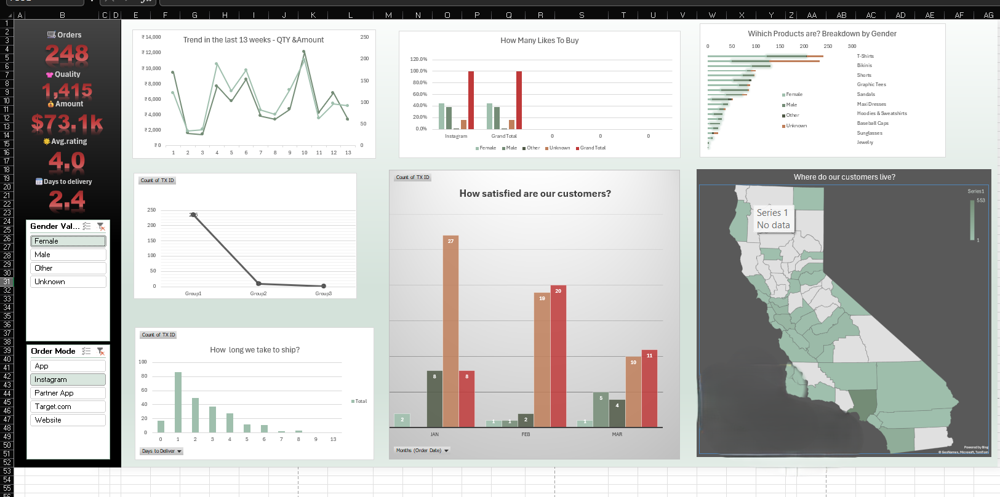

# projects
# Customer Churn Analysis & Dashboard Project

## 📌 Project Overview
This project focuses on analyzing customer churn data to identify key factors that influence customer retention and churn.  
The analysis was performed using **MySQL, Excel, and Power BI**, and interactive dashboards were created for business insights.

---

## 🎯 Objectives
- Understand customer churn patterns
- Identify high-risk customers
- Analyze churn by contract type, gender, services, and tenure
- Create dashboards for decision-making

---

## 🗂 Dataset
- **original dataset.csv** – Raw dataset before cleaning  
- **after_cleaning_mysql.csv** – Cleaned dataset after MySQL processing  

Data includes:
- Customer demographics  
- Contract details  
- Internet & service usage  
- Churn status  

---

## 🛠 Tools & Technologies Used
- **MySQL** – Data cleaning & analysis
- **Excel** – KPI creation & dashboard
- **Power BI** – Interactive dashboard & visualizations

---

## 🔄 Project Workflow
1. Imported raw data into MySQL  
2. Performed data cleaning  
   - Removed null values  
   - Fixed data types  
   - Standardized categories  
3. Executed SQL queries for insights  
4. Exported cleaned data  
5. Built dashboards in Excel & Power BI  

---

## 📊 Dashboards
### 🔹 Power BI Dashboard

### 🔹 Excel Dashboard

---

## 📈 Key Insights
- Month-to-Month customers have the highest churn rate  
- Fiber Optic users churn more compared to DSL  
- Customers with short tenure are more likely to churn  
- Long-term contracts reduce churn significantly  

---

## ✅ Conclusion
This project helps businesses:
- Reduce customer churn
- Improve retention strategies
- Make data-driven decisions

---

## 📬 Contact
**Name:** Chaithanya Krishna  
**Role:** Aspiring Data Analyst  
**GitHub:** https://github.com/chaithu0311
